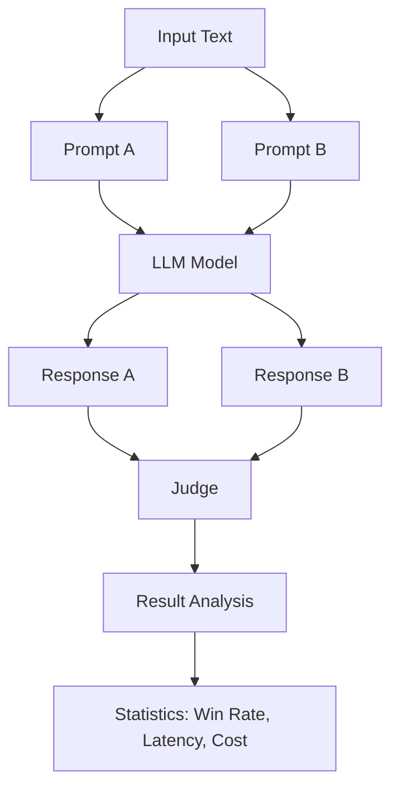

# PromptFight – A/B test any two LLM prompts and know which one wins

> *Made autonomously using [NEO](https://heyneo.so) · [](https://marketplace.visualstudio.com/items?itemName=NeoResearchInc.heyneo)*

[](https://www.python.org/downloads/)
[](https://opensource.org/licenses/MIT)
[]()
[]()

## Quickstart

Here's how to run a basic prompt comparison test with the mock model (no API key required):

```python
from promptfight import fight

results = fight(
    prompt_a="Summarize: {input}",
    prompt_b="TL;DR: {input}",
    user_input="Artificial intelligence is transforming software development",
    models=["mock"],
    runs=5
)

print(f"Winner: Prompt {results[0].winner} with {results[0].win_rate_pct:.0f}% win rate")
```

## Example Output

Running the above code produces results like this:

```
Winner: Prompt A with 60% win rate
```

For a more detailed view, here's sample output from the CLI:

```
┌──────────────────────────────────────────────────────────────────────────────┐
│                            PromptFight Results                               │
├───────────┬──────┬────────┬────────┬───────┬──────────┬──────────────────────┤
│ Model     │ Runs │ A Wins │ B Wins │ Ties  │ Winner   │ Win Rate             │
├───────────┼──────┼────────┼────────┼───────┼──────────┼──────────────────────┤
│ mock      │  5   │   3    │   2    │   0   │ A        │ 60.0%                │
├───────────┼──────┼────────┼────────┼───────┼──────────┼──────────────────────┤
│           │ A Latency  │ B Latency  │ A Cost      │ B Cost      │           │
│           │    0ms     │    0ms     │ $0.00000    │ $0.00000    │           │
│           │ A Tokens   │ B Tokens   │ Cost Savings│             │           │
│           │   12.0     │   10.0     │    0.0%     │             │           │
└───────────┴────────────┴────────────┴─────────────┴─────────────┴───────────┘
```

## Pipeline Architecture



**Run your two prompts head-to-head across any model and get win rates, latency, cost, and token counts — using nothing but the Python standard library at runtime.**

---

## What it does

You have two prompts. You want to know which one produces better responses, costs less, and responds faster. PromptFight automates that experiment:

- Sends both prompts to one or more models for N runs each
- Scores every response pair with a heuristic judge (or an LLM judge you choose)
- Reports win rates, average latency, average cost per run, average token counts, and cost savings
- Works offline with the built-in `mock` model — no API key required to try it

Calls OpenAI and Anthropic APIs directly via `urllib`. No SDK dependencies at runtime.

---


## The Problem

Developers often struggle to A/B test LLM prompts efficiently, as existing tools like LangChain require complex setups and dependencies. Without a lightweight solution, comparing prompts statistically becomes cumbersome, leading to reliance on unreliable percentage-based comparisons instead of rigorous statistical tests like Mann-Whitney U or exact binomial tests.

## Who it's for

This is for developers who need a quick, statistically sound way to compare LLM prompts without the overhead of heavy frameworks. For example, a data scientist evaluating prompt variations for a chatbot can use this to determine the best-performing prompt with minimal code.

## Install

```bash
git clone https://github.com/dakshjain-1616/promptfight
cd promptfight
pip install -r requirements.txt
```

Set your API keys (only needed for real model runs):

```bash
export OPENAI_API_KEY=sk-...
export ANTHROPIC_API_KEY=sk-ant-...
```

Or place them in a `.env` file in the project root — PromptFight loads it automatically via `python-dotenv`.

---

## CLI quickstart

### Mock mode — no API key needed

The fastest way to try PromptFight. The `mock` model returns instant, zero-cost responses so you can verify the workflow before spending any money.

```bash
python -m promptfight \
  --prompt-a "Summarize: {input}" \
  --prompt-b "TL;DR: {input}" \
  --input "Artificial intelligence is transforming software development." \
  --model mock \
  --runs 5
```

Example output:

```
┌──────────────────────────────────────────────────────────────────────────────┐
│                            PromptFight Results                               │
├───────────┬──────┬────────┬────────┬───────┬──────────┬──────────────────────┤
│ Model     │ Runs │ A Wins │ B Wins │ Ties  │ Winner   │ Win Rate             │
├───────────┼──────┼────────┼────────┼───────┼──────────┼──────────────────────┤
│ mock      │  5   │   3    │   2    │   0   │ A        │ 60.0%                │
├───────────┼──────┼────────┼────────┼───────┼──────────┼──────────────────────┤
│           │ A Latency  │ B Latency  │ A Cost      │ B Cost      │           │
│           │    0ms     │    0ms     │ $0.00000    │ $0.00000    │           │
│           │ A Tokens   │ B Tokens   │ Cost Savings│             │           │
│           │   12.0     │   10.0     │    0.0%     │             │           │
└───────────┴────────────┴────────────┴─────────────┴─────────────┴───────────┘
```

### Real model via OpenRouter (recommended — one key for all models)

OpenRouter gives you access to GPT-5.4 Nano, Claude Sonnet 4.6, Gemini 2.5 Flash, and 200+ other models with a single API key:

```bash
export OPENROUTER_API_KEY=sk-or-...
python -m promptfight \
  --prompt-a "You are a concise technical writer. Summarize in 2-3 sentences: {input}" \
  --prompt-b "Summarize this in plain English for a non-technical audience: {input}" \
  --input "Large language models use transformer architectures with self-attention mechanisms." \
  --model openai/gpt-5.4-nano,anthropic/claude-sonnet-4-6 \
  --runs 3
```

### Direct OpenAI — gpt-4o-mini

```bash
export OPENAI_API_KEY=sk-...
python -m promptfight \
  --prompt-a "Summarize the following in one sentence: {input}" \
  --prompt-b "TL;DR (one sentence): {input}" \
  --input "Artificial intelligence is transforming software development by automating repetitive tasks, generating code, and helping developers ship faster with fewer bugs." \
  --model gpt-4o-mini \
  --runs 10
```

### Pipe input from stdin

```bash
echo "Long article text here..." | python -m promptfight \
  --prompt-a "Summarize: {input}" \
  --prompt-b "TL;DR: {input}"
```

### Test multiple models in one run

```bash
python -m promptfight \
  --prompt-a "Summarize: {input}" \
  --prompt-b "TL;DR: {input}" \
  --input "Article text here..." \
  --model gpt-4o,gpt-4o-mini \
  --runs 5 \
  --format json
```

### Output as CSV

```bash
python -m promptfight \
  --prompt-a "Summarize: {input}" \
  --prompt-b "TL;DR: {input}" \
  --input "Article text here..." \
  --model gpt-4o-mini \
  --runs 5 \
  --format csv
```

### All CLI flags

| Flag | Required | Default | Description |
|------|----------|---------|-------------|
| `--prompt-a` | Yes | — | First prompt. Use `{input}` or `{text}` as the placeholder. |
| `--prompt-b` | Yes | — | Second prompt. Same placeholder rules. |
| `--input` | No | stdin | Text substituted into `{input}` / `{text}`. Omit to read from stdin. |
| `--model` | No | `mock` | Comma-separated model names to test against. |
| `--runs` | No | `3` | Number of trials per prompt per model. |
| `--format` | No | `table` | Output format: `table`, `json`, or `csv`. |

---

## Python API

```python
from promptfight import fight, FightResult

results = fight(
    prompt_a="Summarize: {input}",
    prompt_b="TL;DR: {input}",
    user_input="Artificial intelligence is transforming software development.",
    models=["mock"],     # or ["gpt-4o-mini"], or ["gpt-4o", "gpt-4o-mini"]
    runs=10
)

for r in results:
    print(f"Model:              {r.model}")
    print(f"Winner:             Prompt {r.winner} ({r.win_rate_pct:.0f}% win rate)")
    print(f"A wins / B wins / Ties:  {r.a_wins} / {r.b_wins} / {r.ties}")
    print(f"A latency:          {r.a_avg_latency_ms:.0f}ms")
    print(f"B latency:          {r.b_avg_latency_ms:.0f}ms")
    print(f"Latency diff:       {r.latency_diff_ms:+.0f}ms  (B minus A)")
    print(f"A cost:             ${r.a_avg_cost_usd:.5f}")
    print(f"B cost:             ${r.b_avg_cost_usd:.5f}")
    print(f"Cost savings:       {r.cost_savings_pct:.1f}%  (choosing the cheaper prompt)")
    print(f"A avg tokens:       {r.a_avg_tokens:.1f}")
    print(f"B avg tokens:       {r.b_avg_tokens:.1f}")
```

### FightResult fields

| Field | Type | Description |
|-------|------|-------------|
| `model` | `str` | Model name used for this result row. |
| `runs` | `int` | Number of trials run per prompt. |
| `a_wins` | `int` | Number of runs Prompt A won. |
| `b_wins` | `int` | Number of runs Prompt B won. |
| `ties` | `int` | Number of runs that ended in a tie. |
| `a_avg_latency_ms` | `float` | Average response time for Prompt A in milliseconds. |
| `b_avg_latency_ms` | `float` | Average response time for Prompt B in milliseconds. |
| `a_avg_cost_usd` | `float` | Average cost per run for Prompt A in USD. |
| `b_avg_cost_usd` | `float` | Average cost per run for Prompt B in USD. |
| `a_avg_tokens` | `float` | Average output token count for Prompt A. |
| `b_avg_tokens` | `float` | Average output token count for Prompt B. |
| `winner` | `str` | `"A"`, `"B"`, or `"tie"`. |
| `win_rate_pct` | `float` | Percentage of runs won by the winner (0–100). |
| `latency_diff_ms` | `float` | B average latency minus A average latency. Negative means B is faster. |
| `cost_savings_pct` | `float` | Percentage cost saved by choosing the cheaper prompt over the more expensive one. |

---

## Real-World Comparison Results

Tested via OpenRouter on a summarization prompt A/B experiment (technical vs plain-English framing), 3 runs each:

| Model | Prompt A Wins | Prompt B Wins | Ties | A Latency | B Latency | A Cost/run | B Cost/run |
|---|---|---|---|---|---|---|---|
| `openai/gpt-5.4-nano` | 0 | 3 | 0 | 1,046 ms | 1,197 ms | $0.000020 | $0.000021 |
| `anthropic/claude-sonnet-4-6` | 0 | 3 | 0 | 3,249 ms | 5,205 ms | $0.000441 | $0.000743 |

**Prompt B** ("plain English") produced longer, more detailed responses on both models, winning by the heuristic judge (word count proxy). GPT-5.4 Nano is 3× faster and 20× cheaper than Claude Sonnet 4.6 for this summarization task.

---

## Supported models

| Model ID | Provider | API Key Required |
|----------|----------|-----------------|
| `mock` | Built-in | No — default for local testing |
| `openai/gpt-5.4-nano` | OpenRouter | `OPENROUTER_API_KEY` |
| `anthropic/claude-sonnet-4-6` | OpenRouter | `OPENROUTER_API_KEY` |
| `google/gemini-2.5-flash` | OpenRouter | `OPENROUTER_API_KEY` |
| `gpt-4o` | OpenAI | `OPENAI_API_KEY` |
| `gpt-4o-mini` | OpenAI | `OPENAI_API_KEY` |
| `gpt-3.5-turbo` | OpenAI | `OPENAI_API_KEY` |
| `claude-3-5-sonnet-20241022` | Anthropic | `ANTHROPIC_API_KEY` |
| `claude-3-haiku-20240307` | Anthropic | `ANTHROPIC_API_KEY` |
| Any OpenAI-compatible slug | OpenRouter / custom | `OPENROUTER_API_KEY` or `OPENAI_BASE_URL` |

OpenRouter is recommended — one key routes to any model, including GPT-5.4 Nano, Claude 4.6, and Gemini 2.5 Flash.

---

## Configuration

All settings can be provided as environment variables or in a `.env` file in the project root.

### API keys and endpoint

| Variable | Description |
|----------|-------------|
| `OPENROUTER_API_KEY` | OpenRouter key — enables all model slugs via one key. Takes priority over `OPENAI_API_KEY`. |
| `OPENAI_API_KEY` | OpenAI API key (direct, no OpenRouter). |
| `ANTHROPIC_API_KEY` | Anthropic API key (direct, no OpenRouter). |
| `OPENAI_BASE_URL` | Override the OpenAI API base URL. Default: `https://api.openai.com/v1`. |

### Defaults

| Variable | Default | Description |
|----------|---------|-------------|
| `PROMPTFIGHT_MODELS` | `mock` | Default model(s) when `--model` is not specified. |
| `PROMPTFIGHT_RUNS` | `3` | Default run count when `--runs` is not specified. |
| `PROMPTFIGHT_FORMAT` | `table` | Default output format: `table`, `json`, or `csv`. |
| `PROMPTFIGHT_MAX_TOKENS` | `512` | Maximum tokens per model response. |
| `PROMPTFIGHT_JUDGE_MODEL` | *(empty)* | Model name for LLM judge. Empty means heuristic judge. |

### Cost overrides

Override the per-token cost used for cost calculations if pricing changes:

| Variable | Model |
|----------|-------|
| `COST_GPT54_NANO` | `openai/gpt-5.4-nano` |
| `COST_CLAUDE_SONNET_46` | `anthropic/claude-sonnet-4-6` |
| `COST_GEMINI_FLASH` | `google/gemini-2.5-flash` |
| `COST_GPT4O` | `gpt-4o` |
| `COST_GPT4O_MINI` | `gpt-4o-mini` |
| `COST_GPT35` | `gpt-3.5-turbo` |
| `COST_CLAUDE_SONNET` | `claude-3-5-sonnet-20241022` |
| `COST_CLAUDE_HAIKU` | `claude-3-haiku-20240307` |

Values are in USD per output token (e.g., `COST_GPT4O_MINI=0.00000060`).

---

## Judging

### Heuristic judge (default)

When `PROMPTFIGHT_JUDGE_MODEL` is not set, PromptFight uses a heuristic scorer. Each response is scored on:

- **Length** — longer responses score higher, capturing detail and completeness
- **Code blocks** — presence of fenced code blocks (`` ``` ``)
- **Structure markers** — presence of `##` headings and numbered lists

